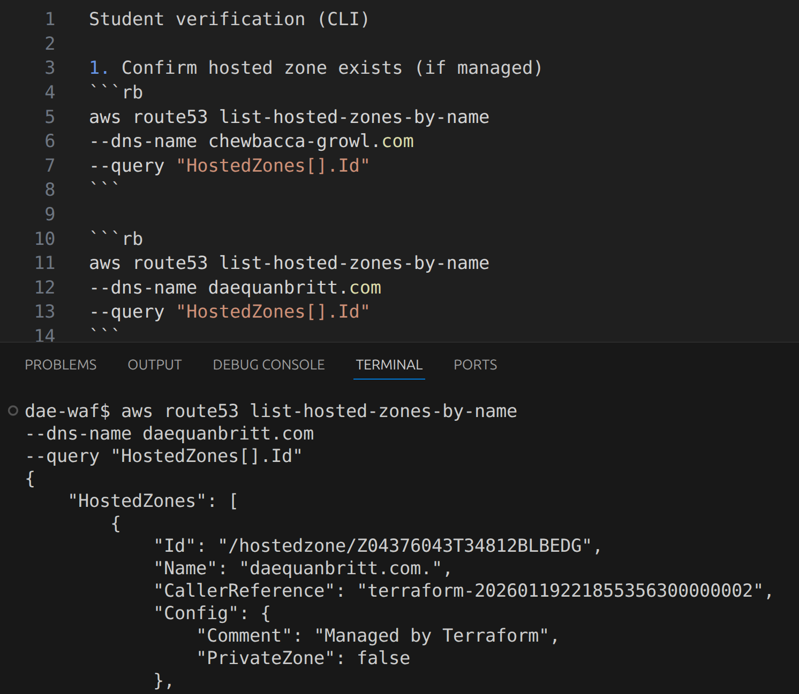
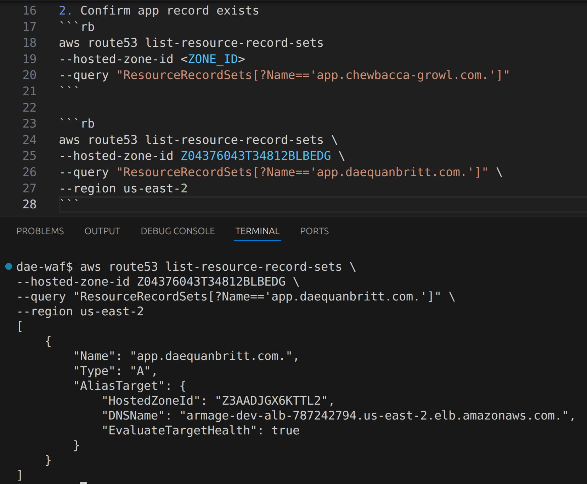
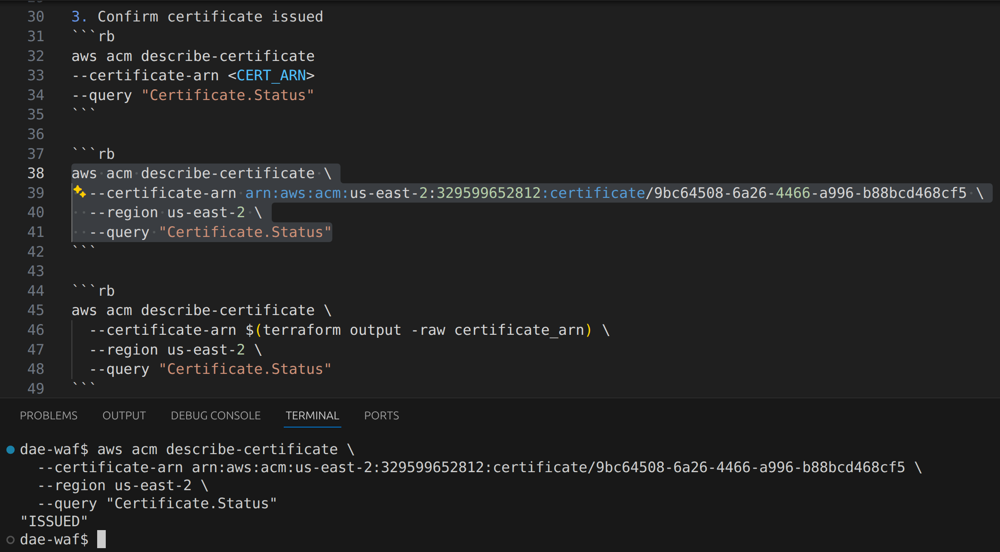
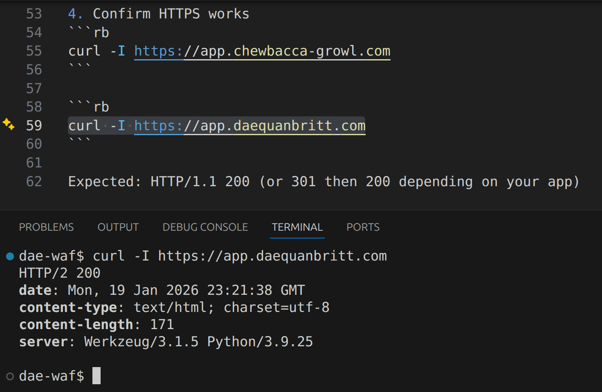

**Project Submission**: Lab 1C-Bonus-B – Enterprise Cloud Pattern

**Engineer**: Dae'Quan Britt

**Stack Summary**: A secure, high-availability web architecture featuring a Public ALB, Private EC2 compute, and automated TLS/DNS management via Route 53 and ACM *(aws certificate manager)*.
___

# 1. Confirm hosted zone exists (if managed)
Verification Results
DNS Infrastructure: Verified the creation of the Public Hosted Zone for daequanbritt.com.

Result: Zone successfully managed by Terraform.
___

# 2. Confirm app record exists
Traffic Routing: Confirmed the app ALIAS record is correctly pointing to the ALB's DNS name.

Result: Global DNS resolution active.

___

# 3. Confirm certificate issued
Security Identity: Confirmed the ACM Certificate for app.daequanbritt.com is issued and in use.

Result: Identity verified via DNS validation.

___

# 4. Confirm HTTPS works
End-to-End Encryption: Successful curl test showing HTTP/2 200 OK over a secure TLS 1.3 connection.

Result: Modern web standards (HTTP/2) successfully negotiated.
___