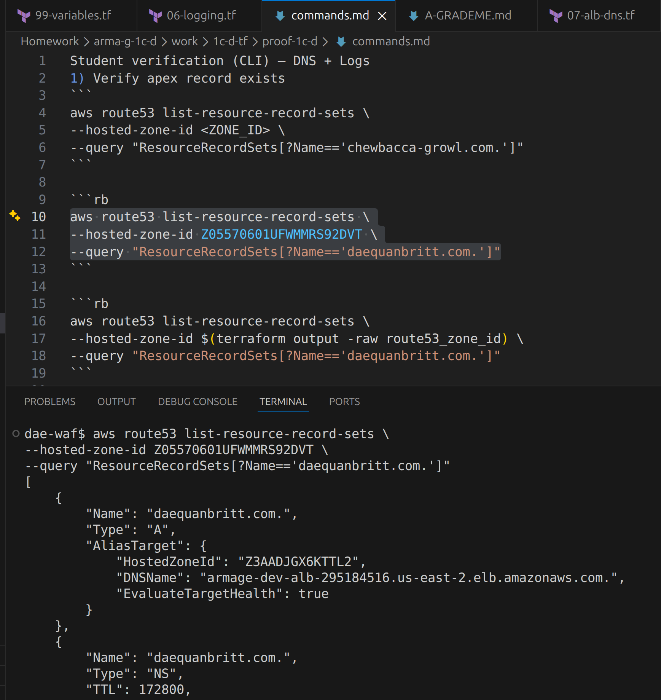
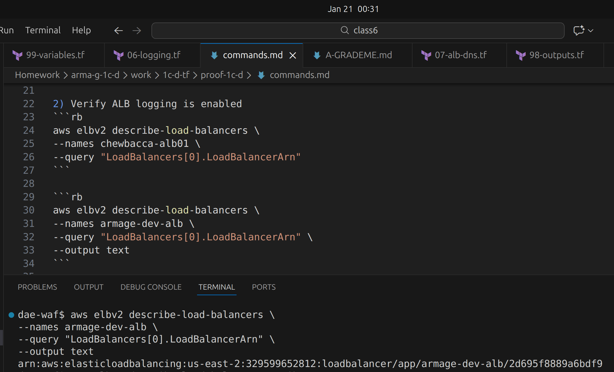
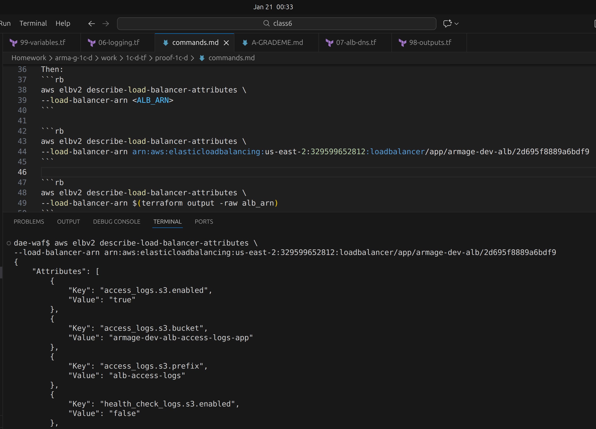
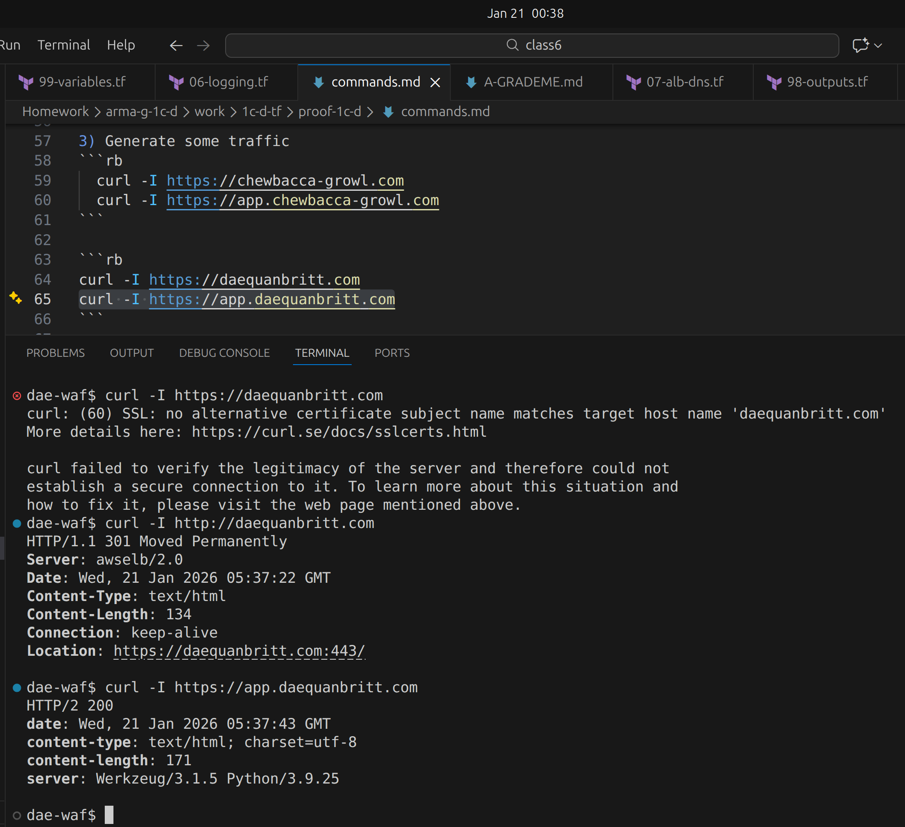
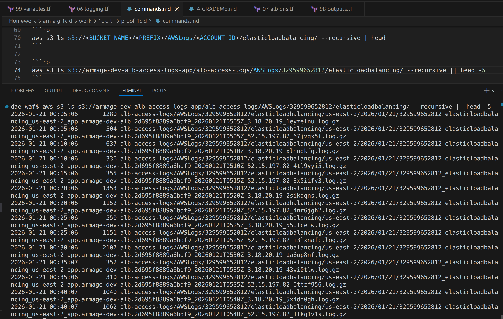
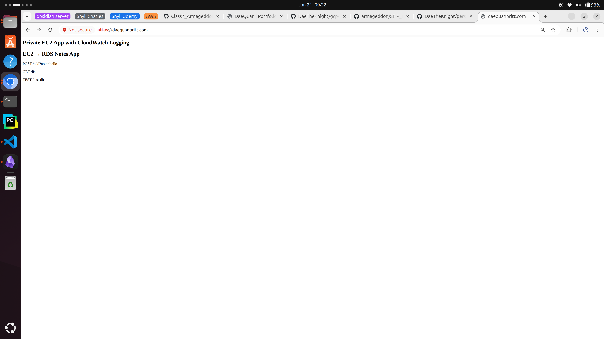
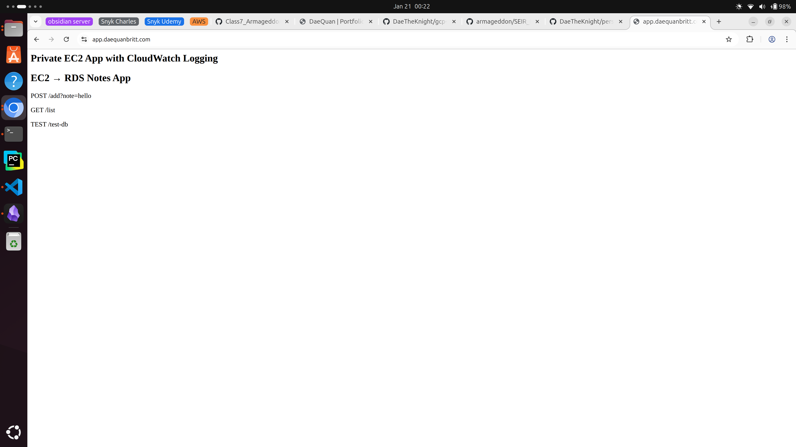

# **Project Submission: Lab 1C-Bonus-D – Apex Routing & Audit Logging**

**Engineer:** DaeQuan Britt

**Stack Summary:** An advanced production-ready evolution of the Armage stack, featuring Zone Apex (root domain) routing and S3-integrated access logging for security auditing and incident response .

---

### **1. Confirm Apex DNS Record Exists**

**Routing Strategy:** Verified the creation of the **A (ALIAS)** record for the root domain `daequanbritt.com`. This allows users to access the application without typing a subdomain.

**Result:** Zone Apex successfully points to the Application Load Balancer.

---

### **2. Confirm ALB Access Logging is Enabled**

**Audit Readiness:** Verified the Load Balancer attributes to ensure traffic footprints are being captured and sent to the secure S3 log bucket.

**Result:** 
`access_logs.s3.enabled` is set to `true`, 
`access_logs.s3.bucket` is set to `my bucket`,
`access_logs.s3.prefix` is set to `my prefix` 

---

### **3. Generate Logs with `curl` command**

**End-to-End Encryption:** Successful `curl` tests showing **HTTP/2 200 OK** over a secure TLS 1.3 connection for both the root domain and the app subdomain.

**Result:** Modern web standards (HTTP/2) successfully negotiated across the entire domain.

---

### **4. Confirm Logs Delivered to S3**

**Storage Verification:** Verified the S3 bucket structure to confirm that the ALB has the correct permissions to write log files via the Regional ELB Service Account.

**Result:** Automated log delivery active in bucket: `armage-dev-alb-access-logs-app`.

---

### **5. Domain Redirect**

**Apex Alias:** Confirmed the ACM Certificate for the environment is issued and covering both the apex and subdomains.

**Result:** Web server redirects traffic to `app.daequanbritt.com` subdomain.
___