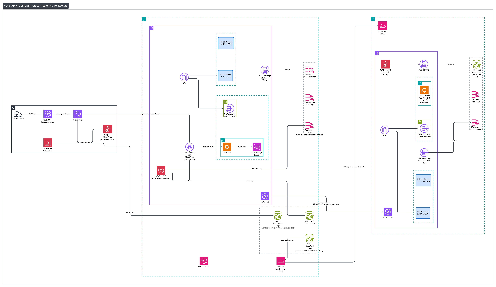

# Lab 3B: Audit Evidence & Regulator-Ready Logging (APPI)

Building on Lab 3A's multi-region infrastructure, this lab adds audit logging, evidence automation, and a compliance evidence pack proving APPI data residency.



## Architecture Overview

```
                         ┌──────────────────────────────────────┐
                         │          Global Entry Point           │
                         │    CloudFront + WAF (Tokyo-owned)     │
                         │    app.daequanbritt.com               │
                         │    Standard Logs → S3                 │
                         └──────────────────┬────────────────────┘
                                            │
              ┌─────────────────────────────┴──────────────────────────────┐
              │                                                            │
 ┌────────────▼──────────────┐                          ┌──────────────────▼──────────────┐
 │  TOKYO (ap-northeast-1)   │                          │  SÃO PAULO (sa-east-1)          │
 │  Project: akihabara       │                          │  Project: liberdade             │
 │  VPC: 10.10.0.0/16        │                          │  VPC: 10.15.0.0/16              │
 ├───────────────────────────┤                          ├─────────────────────────────────┤
 │ • ALB (HTTPS) + WAF       │                          │ • ALB (HTTP) + WAF              │
 │ • EC2 (Flask App)         │                          │ • EC2 (Flask App)               │
 │ • RDS MySQL (Data Auth)   │◄──── TGW Peering ───────►│ • No Database (Compute Only)    │
 │ • Transit Gateway (Hub)   │                          │ • Transit Gateway (Spoke)       │
 │ • CloudFront + Certs      │                          │                                 │
 ├───────────────────────────┤                          ├─────────────────────────────────┤
 │  3B Logging Additions:    │                          │  3B Logging Additions:          │
 │ • CloudTrail (multi-rgn)  │                          │ • VPC Flow Logs → CloudWatch    │
 │ • VPC Flow Logs → CW      │                          │ • S3 versioning on ALB logs     │
 │ • CloudFront logs → S3    │                          │                                 │
 │ • WAF logs → CloudWatch   │                          │                                 │
 │ • S3 versioning (all)     │                          │                                 │
 └───────────────────────────┘                          └─────────────────────────────────┘
```

## Key Features

- **Data Residency Compliance**: RDS MySQL exists only in Tokyo — no database in any other region (APPI)
- **Multi-Region CloudTrail**: Single trail in Tokyo captures management events from all regions, stored in versioned S3
- **VPC Flow Logs**: Network metadata captured in both regions, proving TGW-only cross-region traffic
- **Edge Security Logging**: CloudFront standard logs to S3, WAF Allow/Block logs to CloudWatch
- **Immutability Posture**: S3 versioning enabled on all log buckets (CloudTrail, CloudFront, ALB)
- **Automated Evidence Gathering**: 5 Python scripts generate audit-ready JSON/text proof files

## Directory Structure

```
3b/
├── terraform/
│   ├── tokyo/                      # Primary region (data authority)
│   │   ├── 00-auth.tf              # Providers and backend
│   │   ├── 01-IAM.tf               # IAM roles and policies
│   │   ├── 02-secrets.tf           # Secrets Manager and SSM parameters
│   │   ├── 03-network.tf           # VPC, subnets, TGW, TGW routes
│   │   ├── 04-sg.tf                # Security groups (incl. São Paulo CIDR)
│   │   ├── 05-main.tf              # EC2 and RDS instances
│   │   ├── 06-logging.tf           # CloudWatch, S3 logging, WAF log config
│   │   ├── 07-alb-dns.tf           # ALB, HTTPS listener, Route53 records
│   │   ├── 08-dashboard.tf         # CloudWatch dashboard
│   │   ├── 09-waf.tf               # WAF rules (ALB + CloudFront)
│   │   ├── 10-cloudfront.tf        # CloudFront distribution + standard logging
│   │   ├── 11-cert.tf              # ACM certificates (us-east-1)
│   │   ├── 12-cache.tf             # CloudFront cache policies
│   │   ├── 13-audit-evidence.tf    # CloudTrail, VPC Flow Logs, S3 versioning
│   │   ├── 98-outputs.tf           # Terraform outputs
│   │   ├── 99-variables.tf         # Variable definitions
│   │   ├── terraform.tfvars        # Variable values
│   │   └── 1a_user_data_tf.sh      # EC2 bootstrap script
│   │
│   └── saopaulo/                   # Secondary region (compute only)
│       ├── 00-auth.tf              # Providers and backend
│       ├── 01-IAM.tf               # IAM roles and policies
│       ├── 02-secrets.tf           # SSM parameters (Tokyo RDS endpoint)
│       ├── 03-network.tf           # VPC, subnets, TGW, peering accepter
│       ├── 04-sg.tf                # Security groups
│       ├── 05-main.tf              # EC2 instance (no RDS)
│       ├── 06-logging.tf           # CloudWatch and S3 logging
│       ├── 07-alb-dns.tf           # ALB, HTTP listener (no certs)
│       ├── 08-dashboard.tf         # CloudWatch dashboard
│       ├── 09-waf.tf               # WAF rules (ALB only)
│       ├── 13-audit-evidence.tf    # VPC Flow Logs, S3 versioning
│       ├── 98-outputs.tf           # Terraform outputs
│       ├── 99-variables.tf         # Variable definitions
│       ├── terraform.tfvars        # Variable values
│       └── 1a_user_data_tf.sh      # EC2 bootstrap script
│
├── python/                         # Audit evidence automation scripts
│   ├── malgus_residency_proof.py   # RDS Tokyo-only proof (PASS/FAIL JSON)
│   ├── malgus_tgw_corridor_proof.py    # TGW attachments in both regions
│   ├── malgus_cloudtrail_last_changes.py   # Recent CloudTrail events
│   ├── malgus_waf_summary.py       # WAF Allow/Block counts + top IPs
│   └── malgus_cloudfront_log_explainer.py  # CloudFront Hit/Miss/RefreshHit
│
├── audit-pack/                     # Deliverable A — Audit Evidence Pack
│   ├── 00_architecture-summary.md  # Multi-region APPI architecture description
│   ├── 01_data-residency-proof.txt # RDS exists only in Tokyo (JSON)
│   ├── 02_edge-proof-cloudfront.txt    # CloudFront cache outcome report
│   ├── 03_waf-proof.txt            # WAF Allow/Block summary (JSON)
│   ├── 04_cloudtrail-change-proof.txt  # CloudTrail events both regions (JSON)
│   ├── 05_network-corridor-proof.txt   # TGW attachments both regions (JSON)
│   ├── evidence.json               # Combined output from all scripts
│   └── auditor-narrative.md        # Deliverable B — APPI compliance statement
│
└── README.md                       # This file
```

## What Lab 3B Adds (on top of 3A)

| Resource | Region | Purpose |
|----------|--------|---------|
| CloudTrail Trail | Tokyo (multi-region) | Logs management events from all regions to S3 |
| CloudTrail S3 Bucket | Tokyo | Versioned storage for CloudTrail logs |
| CloudFront Standard Logs | Tokyo | Viewer request logs written to S3 |
| CloudFront Logs S3 Bucket | Tokyo | Versioned storage for CloudFront logs |
| VPC Flow Logs | Tokyo + São Paulo | Network metadata to CloudWatch Logs |
| S3 Versioning | Tokyo + São Paulo | Immutability on CloudTrail, CloudFront, ALB log buckets |

## Deployment

### Prerequisites
- Lab 3A infrastructure already deployed and running
- AWS CLI configured with appropriate permissions
- Terraform installed
- Python 3 with boto3 (`python3 -m venv .venv && source .venv/bin/activate && pip install boto3`)

### Step 1: Deploy Tokyo
```bash
cd terraform/tokyo
terraform plan
terraform apply
```

### Step 2: Deploy São Paulo
```bash
cd terraform/saopaulo
terraform plan
terraform apply
```

### Step 3: Generate Traffic
```bash
curl -I https://daequanbritt.com/api/public-feed
curl -I https://daequanbritt.com/
curl -I https://daequanbritt.com/static/example.txt
```

### Step 4: Wait 5-10 Minutes
Allow logs to populate (CloudFront standard logs take the longest).

### Step 5: Run Audit Scripts
```bash
cd python/
source .venv/bin/activate
mkdir -p ../audit-pack/

python3 malgus_residency_proof.py > ../audit-pack/01_data-residency-proof.txt
python3 malgus_tgw_corridor_proof.py > ../audit-pack/05_network-corridor-proof.txt
python3 malgus_cloudtrail_last_changes.py > ../audit-pack/04_cloudtrail-change-proof.txt
python3 malgus_waf_summary.py --log-group "aws-waf-logs-akihabara-webacl" --region ap-northeast-1 > ../audit-pack/03_waf-proof.txt
python3 malgus_cloudfront_log_explainer.py --bucket akihabara-dev-cloudfront-standard-logs --prefix Chwebacca-logs/ --latest 5 > ../audit-pack/02_edge-proof-cloudfront.txt
```

## Verification Commands

### Data Residency (RDS only in Tokyo)
```bash
# Tokyo — RDS exists
aws rds describe-db-instances --region ap-northeast-1 \
  --query "DBInstances[].{DB:DBInstanceIdentifier,AZ:AvailabilityZone,Region:'ap-northeast-1'}"

# São Paulo — No RDS
aws rds describe-db-instances --region sa-east-1 \
  --query "DBInstances[].DBInstanceIdentifier"
```

### CloudTrail Logs in S3
```bash
aws s3 ls s3://akihabara-dev-cloudtrail-audit-logs/ --recursive | tail -n 10
```

### CloudFront Logs in S3
```bash
aws s3 ls s3://akihabara-dev-cloudfront-standard-logs/Chwebacca-logs/ --recursive | tail -n 10
```

### VPC Flow Logs Active
```bash
aws ec2 describe-flow-logs --region ap-northeast-1 --query "FlowLogs[].{ID:FlowLogId,Status:FlowLogStatus,VPC:ResourceId}"
aws ec2 describe-flow-logs --region sa-east-1 --query "FlowLogs[].{ID:FlowLogId,Status:FlowLogStatus,VPC:ResourceId}"
```

### WAF Logging Active
```bash
aws logs describe-log-groups --region ap-northeast-1 --log-group-name-prefix "aws-waf-logs" --query "logGroups[].logGroupName"
```

## Key Variables

### Tokyo (`terraform.tfvars`)
```hcl
project_name      = "akihabara"
region            = "ap-northeast-1"
saopaulo_tgw_id   = "tgw-0a3c7c6d1092d5d98"
saopaulo_vpc_cidr = "10.15.0.0/16"
```

### São Paulo (`terraform.tfvars`)
```hcl
project_name                = "liberdade"
region                      = "sa-east-1"
tokyo_rds_endpoint          = "akihabara-dev-mysql.cvgusgs2mgvn.ap-northeast-1.rds.amazonaws.com"
tokyo_vpc_cidr              = "10.10.0.0/16"
```

## Six Evidence Categories (Auditor Checklist)

| # | Category | Proof Source | File |
|---|----------|-------------|------|
| 1 | Data Residency | RDS in Tokyo, none in São Paulo | `01_data-residency-proof.txt` |
| 2 | Access Trail | CloudTrail management events | `04_cloudtrail-change-proof.txt` |
| 3 | Change Trail | CloudTrail (who changed SG/WAF/TGW) | `04_cloudtrail-change-proof.txt` |
| 4 | Network Corridor | TGW peering + attachments | `05_network-corridor-proof.txt` |
| 5 | Edge Security | CloudFront logs + WAF Allow/Block | `02_edge-proof-cloudfront.txt`, `03_waf-proof.txt` |
| 6 | Retention / Immutability | S3 versioning on all log buckets | Terraform (`13-audit-evidence.tf`) |

## Lessons Learned

1. **boto3 uses your CLI default region**: Python scripts need explicit `--region` flags or `region_name=` in client calls
2. **CloudFront logging needs BucketOwnerPreferred**: The `log-delivery-write` canned ACL strips FULL_CONTROL and breaks CloudFront
3. **CloudTrail multi-region covers everything**: One trail in Tokyo with `is_multi_region_trail = true` captures both regions
4. **VPC Flow Logs are metadata only**: No PHI exposure — safe for compliance logging
5. **pip3 on modern Linux requires venv**: Use `python3 -m venv .venv` to avoid the externally-managed-environment error

## Resources

- [CloudTrail Concepts](https://docs.aws.amazon.com/awscloudtrail/latest/userguide/cloudtrail-concepts.html)
- [CloudFront Standard Logs](https://docs.aws.amazon.com/AmazonCloudFront/latest/DeveloperGuide/AccessLogs.html)
- [WAF Logging](https://docs.aws.amazon.com/waf/latest/developerguide/logging.html)
- [VPC Flow Logs](https://docs.aws.amazon.com/vpc/latest/userguide/flow-logs.html)
- [APPI Overview](https://www.ppc.go.jp/en/legal/)
