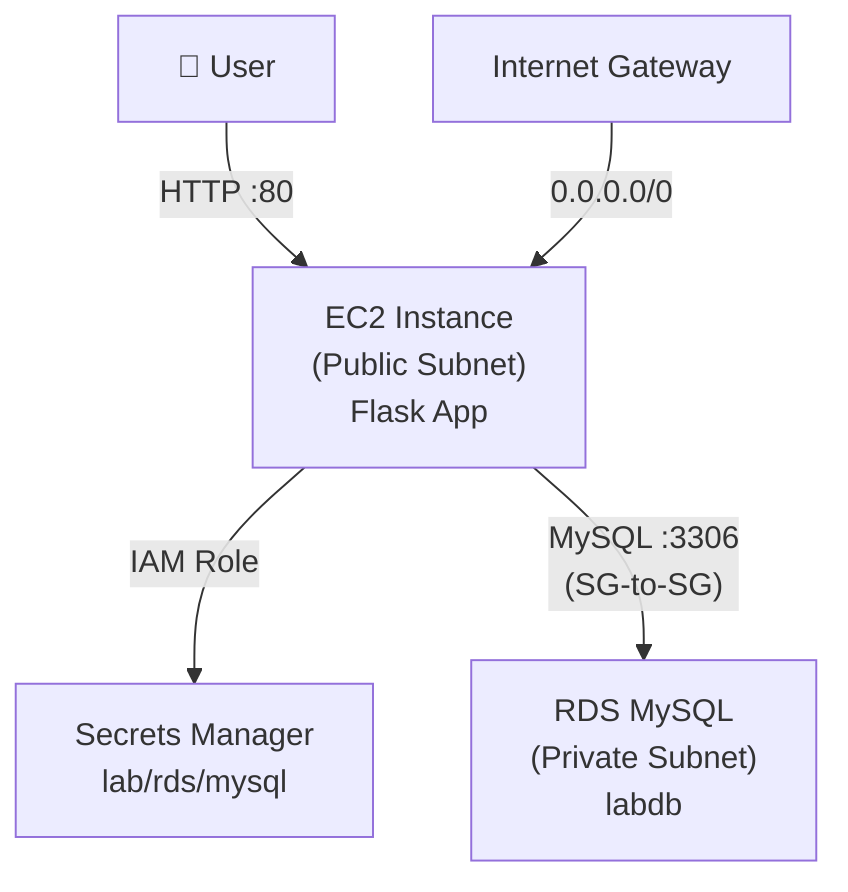

# Lab 1A Execution Record — VPC + EC2 + RDS Foundation

**Manual Deployment: Helga Stack (us-east-2a)**

---

## What I Built

Manual deployment of a secure EC2-to-RDS architecture:

- VPC "Helga" with public/private subnet architecture
- EC2 instance running a Flask notes application
- RDS MySQL database in private subnet
- SG-to-SG reference security pattern (not IP-based)
- IAM role-based access to Secrets Manager
- Full troubleshooting and fixes documented

**Region:** us-east-2 (Ohio)  

**Account:** <Account ID>  

**Naming Convention:** helga

---

## Actual Resources Deployed

### Network Infrastructure

| Resource | Value |
| --- | --- |
| **VPC** | Helga — `10.212.0.0/16` |
| **Region** | us-east-2 |
| **Availability Zone** | us-east-2a |
| **Public Subnet** | For EC2 (with IGW route) |
| **Private Subnet** | For RDS (no direct internet) |
| **Internet Gateway** | Attached to VPC, routed from public subnet |

### Compute & Database

| Resource | Value |
| --- | --- |
| **EC2 Instance** | `lab-ec2-app` (t3.micro or t2.micro, Amazon Linux 2023) |
| **EC2 Application** | Flask notes app at `/opt/rdsapp/[app.py](http://app.py)` |
| **Service Manager** | systemd service `rdsapp` on port 80 |
| **RDS Instance** | `lab-mysql` (MySQL, private subnet) |
| **RDS Endpoint** | [`lab-mysql.chkce02amfxr.us-east-2.rds.amazonaws.com`](http://lab-mysql.chkce02amfxr.us-east-2.rds.amazonaws.com) |
| **Database Name** | `labdb` |
| **DB Port** | 3306 |
| **DB User** | `admin` |

### Security

| Resource | Value |
| --- | --- |
| **EC2 Security Group** | `sg-ec2-lab` — HTTP 80 from `0.0.0.0/0`, SSH 22 from your IP |
| **RDS Security Group** | `sg-rds-lab` — MySQL 3306 from `sg-ec2-lab` only (SG-to-SG reference) |
| **IAM Role** | `RDS-lab-Access` with inline policy for Secrets Manager |
| **IAM Policy** | `AWS_EC2_Secrets_Access` |
| **Secret ID** | `lab/rds/mysql` |

---

## Architecture



---

## Key Challenges Solved

### 1. Subnet Routing (EC2 couldn't reach internet for bootstrap)

**Problem:** User Data script failed silently because EC2 subnet lacked IGW route  

**Fix:** Added `0.0.0.0/0 → Internet Gateway` to public subnet route table  

**Verification:** EC2 could install packages and pull dependencies

### 2. Secret Structure (Missing `host` field)

**Problem:** Initial secret creation didn't include `host` field; app couldn't connect  

**Fix:** Recreated secret using **"Credentials for RDS database"** type in Secrets Manager  

**Result:** Secret auto-populated with `username`, `password`, `host`, `port`, `dbname`, `engine`

### 3. IAM Permissions (Access Denied on secrets)

**Problem:** EC2 role lacked `secretsmanager:GetSecretValue`  

**Fix:** Created inline policy `AWS_EC2_Secrets_Access` with scoped ARN:

```json
{
  "Version": "2012-10-17",
  "Statement": [
    {
      "Sid": "ReadSpecificSecret",
      "Effect": "Allow",
      "Action": ["secretsmanager:GetSecretValue"],
      "Resource": "arn:aws:secretsmanager:us-east-2:<Account ID>:secret:lab/rds/mysql*"
    }
  ]
}
```

**Verification:** `aws secretsmanager get-secret-value --secret-id lab/rds/mysql` succeeded from EC2

### 4. Flask Binding (App unreachable from internet)

**Problem:** Flask app bound to `127.0.0.1` ([localhost](http://localhost) only)  

**Fix:** Updated `user_[data.sh](http://data.sh)` to bind to `0.0.0.0` on port 80  

**Result:** App reachable via public IP

### 5. Security Group Wiring (RDS connection timeout)

**Problem:** RDS SG initially allowed `0.0.0.0/0` or wrong source  

**Fix:** Updated RDS SG inbound rule to reference `sg-ec2-lab` (SG-to-SG pattern)  

**Why this matters:** Industry best practice — dynamic reference, not static IPs

---

## IAM Troubleshooting Checklist (What Actually Worked)

When `/init` hung or secrets couldn't be retrieved, I executed this checklist:

**✅ Trust Relationship**  

IAM Role → Trust relationships tab → Confirmed [`ec2.amazonaws.com`](http://ec2.amazonaws.com) as trusted entity

**✅ Exact ARN Match**  

Ran `aws secretsmanager list-secrets --region us-east-2` → Copied exact ARN → Verified it matched IAM policy Resource field character-by-character

**✅ KMS Check**  

Secret encryption key: `aws/secretsmanager` (default) → No extra `kms:Decrypt` needed

**✅ VPC Endpoint Check**  

Ran `aws ec2 describe-vpc-endpoints` → No Secrets Manager endpoint existed → Not a factor

**✅ Role Attachment**  

EC2 → Actions → Security → Modify IAM role → Attached `RDS-lab-Access`

---

## User Data Script (Final Working Version)

Stored at `/opt/rdsapp/[app.py](http://app.py)`, running as systemd service `rdsapp`:

**Key elements:**

- Uses `boto3` to fetch secret from Secrets Manager
- Binds to `0.0.0.0:80` (not `127.0.0.1`)
- Routes: `/init`, `/add?note=<text>`, `/list`
- DB connection pulls `host`, `username`, `password`, `port` from secret JSON

**Service management:**

```bash
sudo systemctl status rdsapp
sudo systemctl restart rdsapp
sudo journalctl -u rdsapp --no-pager
```

---

## Verification Commands (Actual Execution)

### Infrastructure Verification

```bash
# Verify EC2 is running
aws ec2 describe-instances \
  --filters "Name=tag:Name,Values=lab-ec2-app" \
  --query "Reservations[].Instances[].{ID:InstanceId,State:State.Name,PublicIP:PublicIpAddress}"

# Verify RDS endpoint and status
aws rds describe-db-instances \
  --db-instance-identifier lab-mysql \
  --query "DBInstances[].{Endpoint:Endpoint.Address,Status:DBInstanceStatus}"

# Verify RDS SG shows SG-to-SG reference (not CIDR)
aws ec2 describe-security-groups \
  --group-names sg-rds-lab \
  --query "SecurityGroups[].IpPermissions"
# Expected output: Source = sg-ec2-lab ID, NOT 0.0.0.0/0
```

### Secret & IAM Verification

```bash
# From EC2 instance (SSH in first)
aws secretsmanager get-secret-value \
  --secret-id lab/rds/mysql \
  --region us-east-2

# Verify IAM role is attached
aws ec2 describe-instances \
  --instance-ids <INSTANCE_ID> \
  --query "Reservations[].Instances[].IamInstanceProfile.Arn"
```

### Application Endpoints

```bash
# Initialize database
curl http://<EC2_PUBLIC_IP>/init

# Add notes
curl "http://<EC2_PUBLIC_IP>/add?note=armageddon_lab1a_complete"
curl "http://<EC2_PUBLIC_IP>/add?note=helga_stack_foundation"
curl "http://<EC2_PUBLIC_IP>/add?note=sg_to_sg_reference_works"

# List all notes
curl http://<EC2_PUBLIC_IP>/list
```

---

## Skills Demonstrated

- **VPC Design** — Public/private subnet architecture with IGW routing
- **Security Groups** — SG-to-SG references (not IP-based rules)
- **IAM** — Instance profiles, scoped policies, troubleshooting AccessDeniedException
- **Secrets Management** — Secrets Manager integration with dynamic credential retrieval
- **Troubleshooting** — Subnet routing, secret structure, Flask binding, systemd service debugging
- **CLI Proficiency** — AWS CLI for verification and diagnostics

---

## Interview Talk Track

> "I manually deployed a secure EC2-to-RDS architecture with the database isolated in a private subnet, accessible only through Security Group references — not IP ranges. I stored credentials in Secrets Manager and used an IAM instance profile so the EC2 could retrieve them dynamically without hardcoding. The toughest challenges were getting the subnet routing right for User Data bootstrap, ensuring the secret had all required fields, and configuring the SG-to-SG reference pattern correctly. This foundation taught me the difference between infrastructure that works and infrastructure that's secure and maintainable."
> 

---

## Detailed Execution Notes

Full troubleshooting steps, error messages, and fixes documented at:  

[Lab 1a Working Docs](https://www.notion.so/Lab-1a-Working-Docs-2dad773045f7804ab926d11d301e5844?pvs=21)

---

## Lab 1A Deliverables (Questions & Answers)

### A Why is DB inbound source restricted to the EC2 security group?

**My Answer:**

Because we don't want anybody getting access to this database, and by it only being accessed by the EC2, that will be the only thing that can write into it. Otherwise, other people will be able to put stuff into our database or even launch attacks, and it will leave the database vulnerable.

**Technical Elaboration:**

By setting the RDS security group inbound rule to only allow traffic from the EC2 security group (`sg-ec2-lab`), we implement the **principle of least privilege**:

1. **Only trusted compute resources** (our application on the EC2 instance) can initiate connections to the database on port 3306
2. **No direct public exposure** — the database has no attack surface to the internet
3. **Security group referencing** (using SG ID instead of IP ranges) means if the EC2's IP changes, the rule still works — dynamic and maintainable
4. **Defense in depth** — even if someone compromises another resource in the VPC, they can't reach the DB unless they're part of that specific EC2 security group

This is an example of **security group chaining** — one security group references another, creating a trust relationship between tiers (app tier → data tier).

---

### B What port does MySQL use?

**Answer:** Port **3306**

---

### C Why is Secrets Manager better than storing creds in code/user-data?

**My Answer:**

The Secrets Manager is better because it is natively in AWS. Another unique benefit of using the Secrets Manager is that you don't have to worry about risking the credentials on your actual device and it's inside of your account, and you don't have to go fiddle around with passwords. So the risk of loss is lowered. And then with it also being within AWS, it has a feature where you could even rotate the keys automatically. That way you don't have to worry about remembering to change the password every single time.

**Technical Elaboration:**

Secrets Manager is superior to hardcoding credentials in code or user-data because:

1. **No plaintext exposure** — Credentials in code/user-data can be leaked via version control (Git), logs, or instance metadata. Secrets Manager stores them encrypted at rest with AWS KMS
2. **Automatic rotation** — Secrets Manager can rotate database credentials on a schedule (e.g., every 30 days) without manual intervention or app downtime
3. **IAM-based access control** — Only resources with the right IAM policies can retrieve the secret. Your EC2 instance uses its attached role to authenticate — no credentials baked into the AMI or user-data script
4. **Audit trail** — Every secret access is logged in CloudTrail, giving full visibility into who accessed what and when
5. **No credential sprawl** — One secret, one source of truth. No copies floating around in config files, scripts, or emails

**Security Risk with User-Data:**

Hardcoded credentials in user-data are especially risky because user-data is accessible via the **instance metadata service (IMDS)** at `169.254.169.254`. If an attacker gets SSRF or shell access, they can read it directly. Secrets Manager + IAM roles eliminates that vector entirely.

---